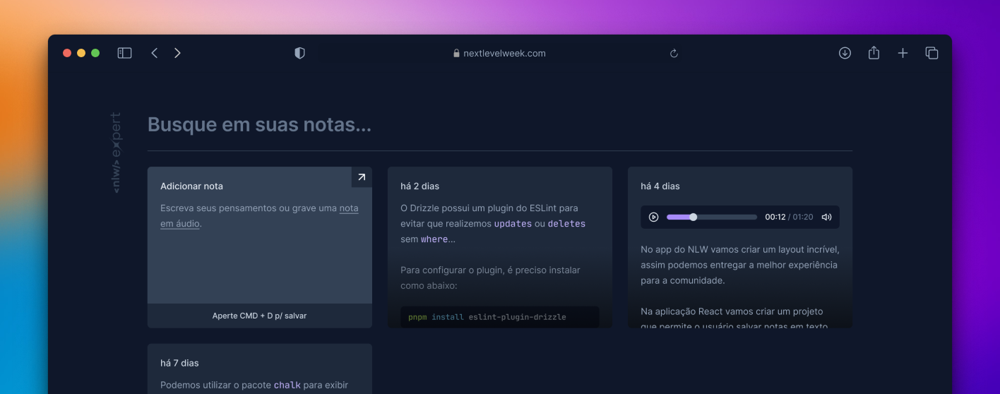

# NLW Expert (React)

This application was developed during Rocketseat's NLW Experts using React, TypeScript, Tailwind, and the SpeechRecognition API.

## Running

After cloning the repository, access the project folder and execute the following commands:

```sh
npm install
npm run dev
```

Acesse http://localhost:5173 para visualizar a aplicação.

## Database Setup

[Install the Turso CLI](https://docs.turso.tech/cli/introduction#installation)

Create a new turso database.

```sh
turso db create notes
```

Get the database URL.

```sh
turso db show notes --url
```

Create an authentication token for your database.

```sh
turso db tokens create notes
```

Create a .env file adding the acquired values from the two commands above as environment variables.

```toml
# .env

TURSO_SYNC_URL=<OBTAINED_URL>
TURSO_TOKEN=<CREATED_TOKEN>
```

Open the created Turso database on the Turso CLI shell to issue SQLite statements:

```sh
turso db shell notes
```

On the Turso CLI shell, issue the following statement to create a "notes" table.

```sql
create table notes (
  id integer primary key,
  note TEXT not null,
  date_created datetime default current_timestamp
);
```
